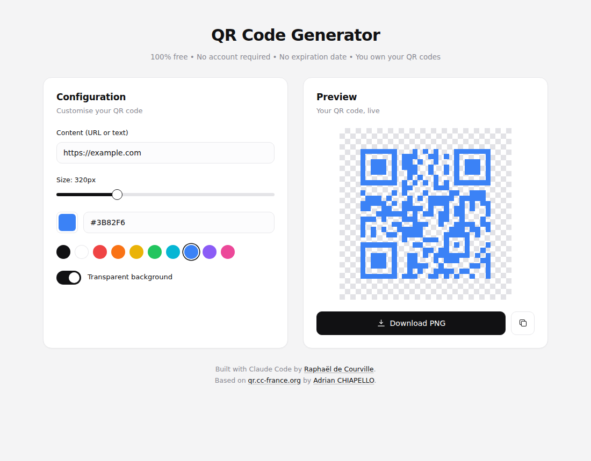

# QR Code Generator

A simple, free, open-source, client-side QR code generator that creates QR codes for URLs, text, and more. 

The application runs entirely in your browser. 

No data is sent to any server.

The QR codes never expire.

## Usage

1. Go to https://sableraf.github.io/QRCodeGenerator/ (hosted on GitHub Pages)
2. Enter any text or URL in the input field
3. Click "Generate QR Code" or press Enter
4. Click "Download PNG" to save the QR code image

## Tech Stack

- HTML5
- CSS3
- Vanilla JavaScript
- [qrcode-generator](https://github.com/davidshimjs/qrcodejs) library

## The Story Behind This Tool

My friend had printed 1,000 posters for his art space with a QR code from a popular online service. At first everything looked fine, but after 100 scans he got a message saying he’d hit the free limit and had to pay to keep the code working. Suddenly all those posters were useless. 

Dynamic QR codes have their uses if you need to change the link later or track analytics, but most people just want a simple, permanent code that points to a website or profile without worrying about limits or fees.

I tried to find a simple and free QR code generator, but the top results were all paid or freemium services. All of them replaced your URL with their own tracking link. It really shouldn't be this hard to find such a basic tool.

So I built this simple QR code generator to fill the gap.

## Disclosure

This project was generated with the help of Claude Code.

## License

This project is licensed under the GPL 3.0 License.